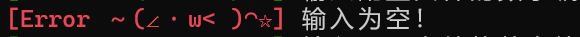

# Image-Bat

此脚本必须使用 PowerShell 才能工作，涉及到的所有工作路径，配置文件内容，输入的变量等**均不能含有中文或英文单引号**，否则会崩溃

ImageMagick 下载链接：https://imagemagick.org/script/download.php

## 工作流程

1.把需要处理的图片拖到.bat文件上面，脚本会扫描当前目录下所有符合要求的文件，但是不会遍历子目录

2.脚本根据 conf_dir 查找配置文件，然后用户在控制台输入文件编号

3.脚本读取配置，循环处理所有的图片

## 脚本配置

### 路径变量

设置路径变量时可用“%~dp0”表示脚本所在目录，用“%%”来表示百分号，例如：

- 若脚本位于 “D:\Bats\图片处理.bat” ，则 “%~dp0配置库” 表示文件夹 “D:\Bats\配置库” ，“%~dp0配置库%%” 表示文件夹 “D:\Bats\配置库%”
- 若图片位于 “E:\phone.jpg” ，则 “配置库” 表示文件夹 “E:\配置库”

1.修改脚本中的“convert_exe_path”变量，其值为exe文件的完整路径，例如：

```
set "convert_exe_path=D:\ImageMagick-7.1.1-27\convert.exe"
```

2.修改脚本中的“out_dir”变量，其值为输出文件的存放文件夹，例如：

```
set "out_dir=图片输出"
```

3.修改脚本中的“conf_dir”变量，其值为配置文件的存放文件夹，例如：

```
set "conf_dir=%~dp0ImageMagick配置库"
```

### 消息前缀变量

1.运行正常时打印消息的前缀，不能有中文或英文单引号，例如：

```
set "ok=[Ciallo～(∠・ω< )◠☆]"
```

效果图：


2.检查到错误时打印消息的前缀，不能有中文或英文单引号，例如：

```
set "no=[Error ～(∠・ω< )◠☆]"
```

效果图：



### 额外工作变量

目前额外工作变量有三个，bat脚本中设置的是默认值，**如果配置文件中也设置了同名变量，则会优先使用配置文件中定义的值**

1.修改脚本中的“keep_create_date”变量，如果要使文件创建日期不变：

```
set "keep_create_date=true"
```

2.修改脚本中的“keep_revise_date”变量，如果要使文件修改日期不变：

```
set "keep_revise_date=true"
```

3.修改脚本中的“delete_source_file”变量，如果要在文件处理完成后保留源文件：

```
set "delete_source_file=false"
```

## 配置文件

### 命名要求

把常用的配置储存起来，搭建配置库，使用的时候只需要输入编号

配置文件名需要符合“\(两位数字编号).\(配置名).txt”，例如：

```
01.转换格式为最高压缩比的PNG.txt
```

效果图：


### 内容要求

若英文分号写在行开头则表示注释，脚本会忽略这一行的内容，配置文件中**不可以含有英文或中文单引号**

1.“command”变量不能为空，其值为exe支持的命令行

- \[*in]表示输入文件，\[*out]表示输出文件，注意前后不要跟任何字符，例如 \_\[*out]_ 是错误的
- 如果要输入双引号，需要转义为\\\"，同样如果要输入反斜杠也需要转义为\\\\

```
command=[*in] -quality 100 [*out]
```

2.“output_suffix”变量不能为空，其值为输出文件的小写后缀名，例如 jpeg ，但 .jpeg 是错误的，例如：

```
output_suffix=png
```

3.以下三个变量均可以为空，不为空会覆盖脚本的默认值，例如：

```
//覆盖默认值
keep_create_date=true
//注释行
;keep_revise_date=true
//变量为空，使用默认值
delete_source_file=
```

## 进阶玩法
可以对脚本进行修改之后，套用到其他exe上，例如 ffmpeg.exe 等。
